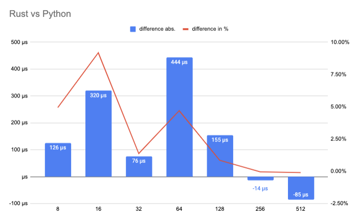

# Pipeline modules implemented with `ONNX` and `tokenizers`


```bash
cargo build --release

cargo run --release

```

### Benchmark

To run benchmarks is used [Citerion](https://github.com/bheisler/criterion.rs) with `cargo bench`. 

Run

```bash
cargo bench
```

#### Results 

`Cascade-lake` cpu
```bash
model name      : Intel(R) Xeon(R) Platinum 8259CL CPU @ 2.50GHz
physical id     : 0
siblings        : 4
core id         : 0
cpu cores       : 2
apicid          : 0
initial apicid  : 0
```

https://docs.google.com/spreadsheets/d/1U1aQpLercXD5vPvDS7Qg8On4aVKIngDx9A2a7Yx1Qok/edit?usp=sharing



## Resources

* [softmax](https://github.com/CasperN/drug/blob/1a7cc4532aa4bdb7ce091a53d2d6b14ab2d5a0dd/src/lib.rs#L77)
* [argmax: statistical methods for ndarray's ArrayBase type.](https://github.com/rust-ndarray/ndarray-stats)
* [ndarray](https://github.com/rust-ndarray/ndarray)

## Todo

* [ ] add `cargo bench`
* [x] wrap `tokenizer` for easier error handle and configuration for GPU
* [x] add `from_path` to `Pipeline` trait
* [ ] add batching
* [ ] add configuration parameters, like all scores, or only the top-k
* [ ] test Ice-lake and other models